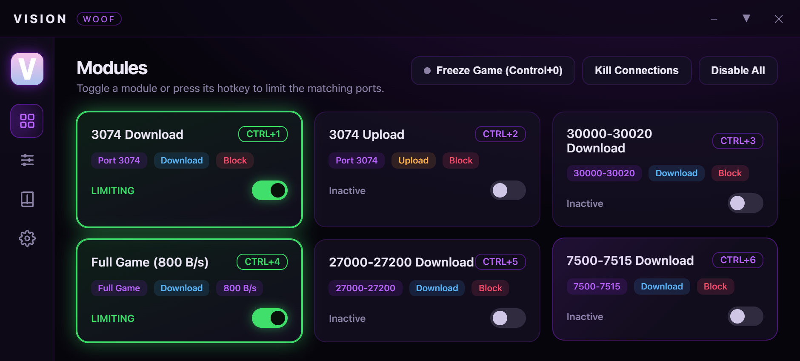
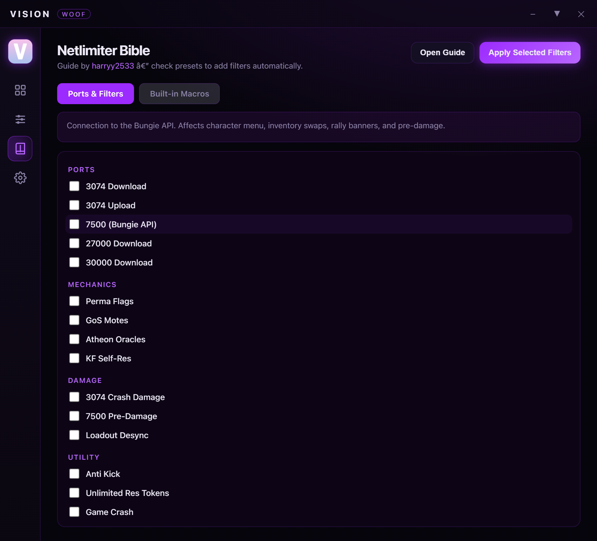
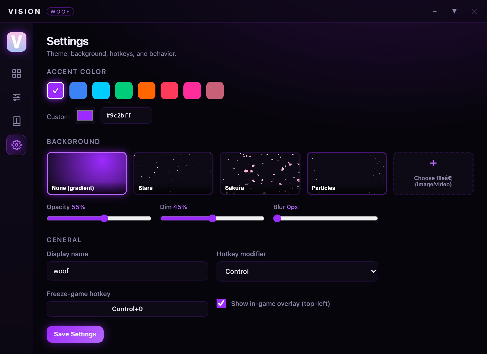

<div align="center">
  
  <h1>Vision Client</h1>
  <p>Destiny 2 network limiter with a bundled WinDivert engine.</p>
</div>







## Download

Get the latest build from the [Releases](https://github.com/aarxndev/Vision-Client/releases) page.

- Windows x64
- Run as Administrator (WinDivert loads a kernel driver)

## Build from source

```powershell
npm install
npm start
```

Run your terminal as Administrator. Build a portable executable with `npm run build`.

## License

MIT. Bundles WinDivert (LGPL, from basil00/WinDivert).
